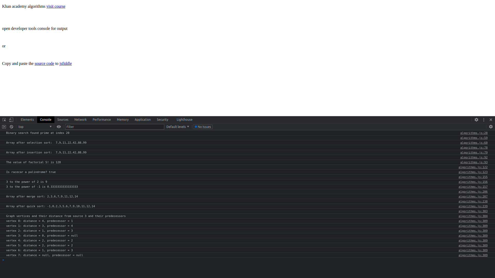

The purpose of this project was to practice some common data structures and algorithms. This material is covered here on code academy. https://www.khanacademy.org/computing/computer-science/algorithms

For console output visit this project live at: https://jmart6784.github.io/khan-academy-algorithms/

OR

Copy and paste the source code into jsfiddle.
https://jsfiddle.net/
